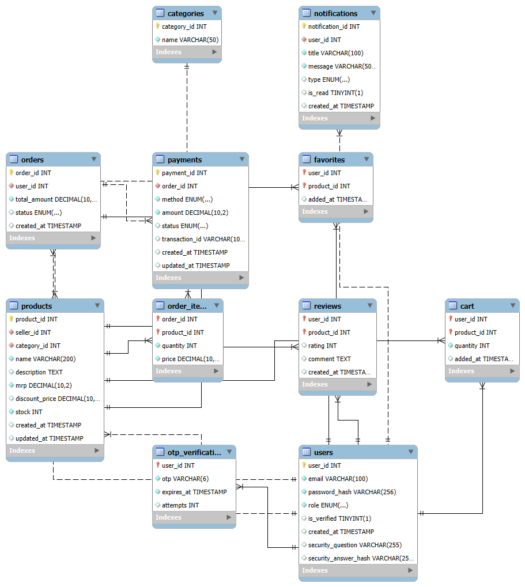
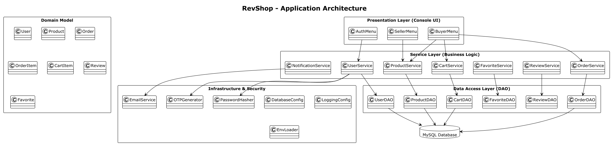

# 🛒 RevShop — Enterprise-Grade System Design Documentation
*Designing a future-ready console e-commerce platform with clarity, rigor, and intent.*

---

## 📌 Table of Contents
1. [Executive Overview](#-executive-overview)
2. [Why RevShop Matters](#-why-revshop-matters)
3. [System at a Glance](#-system-at-a-glance)
4. [Database Design & ER Modeling](#-database-design--er-modeling)
5. [Application Architecture](#-application-architecture)
    - [Layered Architecture Breakdown](#-layered-architecture-breakdown)
6. [Project Structure Deep Dive](#-project-structure-deep-dive)
7. [Key Design Decisions & Best Practices](#-key-design-decisions--best-practices)
8. [Tooling & Technology Stack](#-tooling--technology-stack)
9. [Scalability, Extensibility & Future Roadmap](#-scalability-extensibility--future-roadmap)
10. [Notes & Conventions](#-notes--conventions)
11. [Authorship](#-authorship)

---

## 🧭 Executive Overview

**RevShop** is a **modular, console-based e-commerce system** engineered with **Java 17 and Maven**, following a **clean, layered architecture** that mirrors real-world enterprise systems.

Although console-driven today, RevShop is intentionally architected as a **stepping stone toward web-scale systems**—making it ideal for:
- Backend engineers
- System design interviews
- Open-source extensibility
- Migration to Spring Boot / Microservices

> **Positioning Statement**  
> *RevShop is not just a project — it is a blueprint for building production-grade commerce systems from first principles.*

---

## 💡 Why RevShop Matters

Most beginner e-commerce projects collapse under:
- Tight coupling between UI and database
- Poor separation of concerns
- Zero consideration for scalability or evolution

**RevShop solves this by design.**

### The Problems It Intentionally Addresses
- ❌ Monolithic spaghetti logic
- ❌ SQL scattered across UI code
- ❌ Hard-to-test business rules

### The Principles It Enforces
- ✅ Layer isolation
- ✅ Explicit domain models
- ✅ Clear ownership of responsibilities
- ✅ Database-backed integrity

---

## 🧩 System at a Glance

| Capability | Description |
|---------|------------|
| User Roles | Buyers & Sellers |
| Authentication | Secure login with hashing + OTP |
| Commerce | Products, Orders, Cart, Favorites |
| Trust Layer | Reviews & ratings |
| Inventory | Real-time stock tracking |
| Persistence | MySQL with procedures & triggers |
| Architecture | Layered, extensible |

---

## 🗄️ Database Design & ER Modeling

The **Entity Relationship (ER) Diagram** captures the complete domain model of RevShop, translating business concepts into normalized relational structures.



### Core Entities

| Entity | Responsibility |
|------|---------------|
| `User` | Buyers & Sellers (role-based behavior) |
| `Product` | Seller-owned inventory items |
| `Order` | Purchase transaction |
| `OrderItem` | Line-level order details |
| `Cart` | Pre-checkout holding area |
| `Review` | Buyer feedback & trust signals |
| `Inventory` | Stock lifecycle management |

### Relationship Highlights
- **One-to-Many**: `User → Orders`
- **One-to-Many**: `Order → OrderItems`
- **Many-to-One**: `Review → Product`
- **One-to-One / Derived**: `Product ↔ Inventory`

> **BEST PRACTICE**  
> Inventory updates are handled via **database triggers**, ensuring consistency even if application logic fails.

> **WARNING**  
> Avoid performing inventory deductions purely in application code — race conditions are inevitable under concurrency.

---

## 🏗️ Application Architecture

RevShop adopts a **classic layered architecture**, deliberately chosen for:
- Predictability
- Testability
- Migration readiness



---

## 🧱 Layered Architecture Breakdown

### 1️⃣ UI Layer — *Interaction, not Intelligence*

**Responsibility**
- Console menus
- User input/output
- Flow navigation

**Packages**
```text
ui/
├── AuthMenu
├── BuyerMenu
└── SellerMenu
COMMON MISTAKE
Putting business logic in menus.
Rule: UI asks questions, services answer them.

2️⃣ Service Layer — The Brain of the System
Responsibilities

Business rules

Validation

Transaction coordination

Use-case orchestration

Packages

service/
├── UserService
├── ProductService
├── OrderService
└── ReviewService
TIP
Services should read like use-cases, not utilities.

3️⃣ DAO Layer — Persistence Isolation
Responsibilities

SQL execution

ResultSet → Model mapping

Zero business logic

Packages

dao/
├── UserDAO
├── OrderDAO
├── CartDAO
└── InventoryDAO
BEST PRACTICE
A DAO should be replaceable without breaking the service layer.

4️⃣ Model Layer — Pure Domain Representation
Responsibilities

POJOs only

No database or UI logic

Represents business nouns

Packages

model/
├── User
├── Product
├── Order
└── Review
5️⃣ Security Layer — Trust & Protection
Responsibilities

Password hashing

OTP generation

Email notifications

Packages

security/
├── PasswordHasher
├── OTPGenerator
└── EmailService
NOTE
Security is intentionally decoupled to allow replacement with OAuth / JWT later.

6️⃣ Configuration & Utilities — System Glue
Responsibilities

DB configuration

Logging setup

Input validation

Console formatting

Packages

config/
util/
env/
7️⃣ Database Layer — The Source of Truth
sql/
├── schema/
├── procedures/
├── triggers/
└── sample-data/
WHY IT MATTERS
Business-critical constraints belong in the database — not just in Java.

🗂️ Project Structure Deep Dive
src/main/java/com/revshop
├── app        # Application entry point
├── config     # DB & logging config
├── dao        # Data access
├── env        # Environment configs
├── model      # Domain models
├── security   # Auth & protection
├── service    # Business logic
├── ui         # Console interaction
└── util       # Shared helpers
🧠 Key Design Decisions & Best Practices
Decision	Rationale
Layered Architecture	Predictable & testable
DAO Pattern	DB isolation
Triggers & Procedures	Data integrity
Maven	Dependency control
Console UI	Focus on backend purity
🛠️ Tooling & Technology Stack
Category	Technology
Language	Java 17
Build Tool	Maven
Database	MySQL
Logging	Log4j2
ER Design	MySQL Workbench
Architecture Diagrams	PlantUML
Testing	JUnit
🚀 Scalability, Extensibility & Future Roadmap
RevShop is intentionally migration-ready.

Planned Evolutions
🔄 Spring Boot REST APIs

🔐 JWT / OAuth authentication

🧱 Microservices (Order, User, Product)

☁️ Cloud deployment (Docker + Kubernetes)

📊 Observability (Metrics & Tracing)

DESIGN PHILOSOPHY
Build today like you’ll scale tomorrow.

📝 Notes & Conventions
All diagrams live under docs/

Architecture diagrams are source-controlled

Database logic is treated as first-class

docs/
├── erd/
│   └── revshop-erd.png
└── architecture/
    └── revshop-application-architecture.png
✍️ Authorship
Author: Gundeti Benhur Joy
Project: RevShop